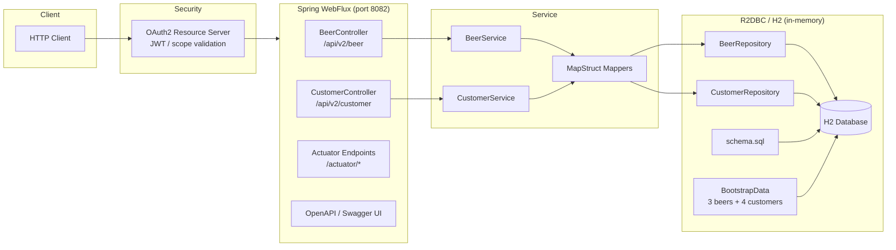

# Spring 6 Reactive

Welcome to the "Spring Framework 6: Beginner to Guru" project! This project is designed to help you explore and understand the latest features of Spring Framework 6 through practical code examples.
Here's a quick guide to get you started and contributing:

## Getting Started:

Server runs on port 8082/30082. Requires the auth server running on port 9000/30900.
The auth-server starts automatically via Docker Compose (`compose.yaml`) because `spring.docker.compose.enabled=true` in application.yaml.

Use the checked-in IntelliJ run configuration `.run/Spring6ReactiveApplication.run.xml` to start the app locally (no manual setup required).

## Sandbox

The sandbox consists of the app (Spring Boot, port 8082) plus an auth-server (port 9000) provided by Docker Compose. The auth-server starts automatically via `spring.docker.compose.enabled=true` when the app boots, so usually one step is enough.

Initial setup (one-time, allow sandbox kit sources):

```powershell
sbx settings set kit.allowedSources --% "[\"docker.io/\",\"github.com/dboeckli/\"]"
```

Add the sandbox kit:

```powershell
sbx kit add git+https://github.com/dboeckli/opencode-sandbox-kit.git#dir=opencode-agent
```

Start the sandbox (usually from PowerShell):

```powershell
sbx run opencode --name spring-6-reactive --kit "git+https://github.com/dboeckli/opencode-sandbox-kit.git#dir=opencode-agent" "C:\development\projects\spring-6-reactive"
```

Start the sandbox with Kubernetes support:

```powershell
sbx run opencode --name spring-6-reactive --kit "git+https://github.com/dboeckli/opencode-sandbox-kit.git#dir=opencode-agent" "C:\development\projects\spring-6-reactive" "$env:USERPROFILE\.kube:ro"
```

Start the sandbox from WSL:

```bash
opencode --name spring-6-reactive --kit "git+https://github.com/dboeckli/opencode-sandbox-kit.git#dir=opencode-agent" "/mnt/c/development/projects/spring-6-reactive"
```

Remove the sandbox:

```powershell
sbx remove spring-6-reactive
```

### Start the app

```shell
docker compose up        # optional: start auth-server manually (else it starts with the app)
```

Then run the `Spring6ReactiveApplication` run configuration in IntelliJ (`.run/Spring6ReactiveApplication.run.xml`, main class `guru.springframework.spring6reactive.Spring6ReactiveApplication`).

The compose file brings up:

- `auth-server` (port 9000) — required by the OAuth2 resource server
- `busybox` sidecar — polls the auth-server readiness every 10s and prints the health status

### Verify

- Swagger UI: http://localhost:8082/swagger-ui/index.html
- OpenAPI json: http://localhost:8082/v3/api-docs
- h2 console: http://localhost:8088
- auth-server readiness: http://localhost:9000/actuator/health/readiness

### Stop / clean up

```shell
docker compose down      # stop and remove containers
docker compose down -v   # additionally remove volumes
```

## Project Structure:

`pom.xml`: This is your main Maven configuration file. It manages dependencies, plugins, and build settings.
`src` Directory: Contains your main Java source code and resources, as well as test code.
`restRequests` Directory: Houses resources for REST requests, including authentication HTTP requests and HTTP client configurations.

## Architecture



## Urls

- h2 console:
  - http://localhost:8088
  - http://localhost:30088
- openapi api-docs:
  - http://localhost:8082/v3/api-docs
  - http://localhost:30082/v3/api-docs
- openapi gui:
  - http://localhost:8082/swagger-ui/index.html
  - http://localhost:30082/swagger-ui/index.html
- openapi-yaml:
  - http://localhost:8082/v3/api-docs.yaml
  - http://localhost:30082/v3/api-docs.yaml

## Kubernetes

To run maven filtering for destination target/k8s and target target/helm run:

```bash
mvn clean install -DskipTests 
```

### Deployment with Kubernetes

Deployment goes into the default namespace.

To deploy all resources:

```bash
kubectl apply -f target/k8s/
```

To remove all resources:

```bash
kubectl delete -f target/k8s/
```

Check

```bash
kubectl get deployments -o wide
kubectl get pods -o wide
```

You can use the actuator rest call to verify via port 30082

### Deployment with Helm

Be aware that we are using a different namespace here (not default).

Go to the directory where the tgz file has been created after 'mvn install'

```powershell
cd target/helm/repo
```

unpack

```powershell
$file = Get-ChildItem -Filter spring-6-reactive-v*.tgz | Select-Object -First 1
tar -xvf $file.Name
```

install

```powershell
$APPLICATION_NAME = Get-ChildItem -Directory | Where-Object { $_.LastWriteTime -ge $file.LastWriteTime } | Select-Object -ExpandProperty Name
helm upgrade --install $APPLICATION_NAME ./$APPLICATION_NAME --namespace spring-6-reactive --create-namespace --wait --timeout 5m --debug --render-subchart-notes
```

show logs and show event

```powershell
kubectl get pods -n spring-6-reactive
```

replace $POD with pods from the command above

```powershell
kubectl logs $POD -n spring-6-reactive --all-containers
```

Show Details and Event

$POD_NAME can be: spring-6-reactivedb, spring-6-reactive

```powershell
kubectl describe pod $POD_NAME -n spring-6-reactive
```

Show Endpoints

```powershell
kubectl get endpoints -n spring-6-reactive
```

test

```powershell
helm test $APPLICATION_NAME --namespace spring-6-reactive --logs
```

uninstall

```powershell
helm uninstall $APPLICATION_NAME --namespace spring-6-reactive
```

delete all

```powershell
kubectl delete all --all -n spring-6-reactive
```

create busybox sidecar

```powershell
kubectl run busybox-test --rm -it --image=busybox:1.36 --namespace=spring-6-reactive --command -- sh
```

You can use the actuator rest call to verify via port 30082

## Docker

### create image

```shell
.\mvnw clean package spring-boot:build-image
```

or just run

```shell
.\mvnw clean install
```

### run image

Hint: remove the daemon flag -d to see what is happening, else it run in background

```shell
docker run --name reactive -d -p 8082:8080 -e SPRING_SECURITY_OAUTH2_RESOURCESERVER_JWT_ISSUER_URI=http://auth-server:9000 -e SERVER_PORT=8080 --link auth-server:auth-server spring-6-reactive:0.0.1-SNAPSHOT
 
docker stop reactive
docker rm reactive
docker start reactive
docker logs reactive
```

